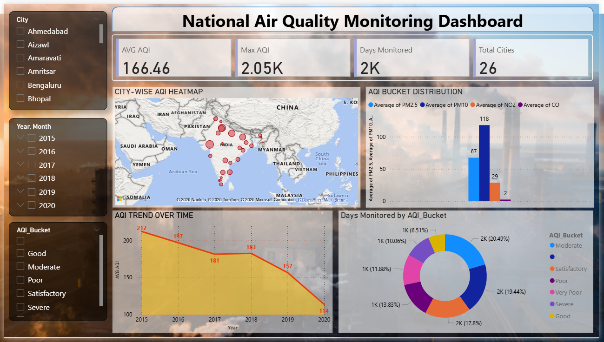

# 🌫️ National Air Quality (AQI) Analytics Project

> A multi-tool data analytics project that explores air quality trends across 26 Indian cities from 2015 to 2020, using SQL, Python, Excel, and Power BI.

---

## 📊 Power BI Dashboard



The dashboard provides an interactive view of:
- **Average & Maximum AQI** across all cities
- **City-wise AQI Heatmap** plotted on an India map
- **AQI Trend Over Time** (2015–2020)
- **AQI Bucket Distribution** (Good / Satisfactory / Moderate / Poor / Very Poor / Severe)
- **Pollutant Comparison** (PM2.5, PM10, NO2, CO) by AQI Bucket
- **Days Monitored by AQI Bucket** (donut chart)
- Interactive filters for **City**, **Year/Month**, and **AQI Bucket**

---

## 📁 Project Structure

```
AQI-Analytics/
│
├── Vansh_Shah_Aqi_Analytics_Batch-7.sql       # SQL — Data ingestion & cleaning
├── Vansh_Shah_Aqi_Analytics_Batch-7.ipynb     # Python — EDA & feature engineering
├── Vansh_Shah_Aqi_Analytics_Batch-7.xlsx      # Excel — Pivot tables & summaries
├── Vansh_Shah_Aqi_Analytics_Batch-7.pbix      # Power BI — Interactive dashboard
└── README.md
```

---

## 🛠️ Tools & Technologies

| Tool       | Purpose |
|------------|---------|
| **MySQL**  | Data ingestion, validation, cleaning, feature table creation |
| **Python** | Data wrangling, null/zero handling, feature engineering, EDA charts |
| **Excel**  | Pivot tables, city-wise summaries, pollutant averages |
| **Power BI** | Interactive dashboard and data storytelling |

---

## 🔄 Project Workflow

### 1. 🗄️ SQL — Data Ingestion & Cleaning
- Created `city_day` table with all pollutant columns (`PM2.5`, `PM10`, `NO`, `NO2`, `NOx`, `NH3`, `CO`, `SO2`, `O3`, `Benzene`, `Toulene`, `Xylene`, `AQI`, `AQI_Bucket`)
- Loaded raw CSV data using `LOAD DATA LOCAL INFILE`
- Identified and counted NULL/zero values across all pollutant columns
- Preserved raw data via `city_day_raw` backup table
- Created `city_day_clean` table with added engineered columns: `Month`, `Monthly_AQI`, `PM25_PM10_Ratio`

### 2. 🐍 Python — EDA & Feature Engineering
- Connected to MySQL and pulled data using `pandas.read_sql`
- Replaced zeros and blanks with `NaN` across all pollutant columns
- Imputed missing values with **column-wise median**
- Standardized `City` and `AQI_Bucket` text (strip + lowercase)
- Engineered new features:
  - `Month` — extracted from `Date`
  - `Monthly_AQI` — group-level mean AQI per month
  - `PM25_PM10_Ratio` — ratio of fine particulate matter
- Pushed cleaned data back to the `city_day_clean` MySQL table
- Visualized:
  - Stacked bar chart: Average pollutant contribution per city
  - Pie chart: AQI Bucket distribution
  - Bar chart: Average Benzene levels per city
  - Bar chart: PM2.5 vs PM10 comparison
  - Histogram: AQI frequency distribution

### 3. 📊 Excel — Pivot Analysis
- City-wise average AQI ranking (Ahmedabad highest at ~452, Aizawl lowest at ~35)
- AQI Bucket count breakdown (Moderate: 8,829 | Satisfactory: 8,224 | Poor: 2,781)
- Top 5 most polluted cities: Ahmedabad, Delhi, Patna, Gurugram, Lucknow
- Cleanest cities: Aizawl, Shillong, Coimbatore, Thiruvananthapuram
- Overall pollutant averages: PM2.5 (67.45), PM10 (118.13), NO2 (28.56)

### 4. 📈 Power BI — Dashboard
- Connected to cleaned Excel/MySQL data
- Built an interactive dashboard with slicers for City, Year/Month, and AQI Bucket
- Visualized AQI trends showing a declining pattern from 212 (2015) → 114 (2020)
- Created geographic heatmap of city-wise AQI across India

---

## 📌 Key Insights

- 🏙️ **Ahmedabad** recorded the highest average AQI (~452), classified as **Severe**
- 🌿 **Aizawl** had the cleanest air with an average AQI of ~35 (**Good**)
- 📉 National average AQI **declined from 212 (2015) to 114 (2020)**, indicating improving air quality over the years
- 🧪 **PM10** (avg: 118) is the dominant pollutant across cities, followed by **PM2.5** (avg: 67)
- 📅 The dataset covers **~24,850 days of monitoring** across **26 cities**
- ⚠️ Most days fall in the **Moderate** (8,829) and **Satisfactory** (8,224) AQI buckets

---

## 📦 Dataset

The dataset used is the **India Air Quality Data** (`city_day.csv`), which contains daily air quality readings for 26 Indian cities from 2015 to 2020.

Columns: `City`, `Date`, `PM2.5`, `PM10`, `NO`, `NO2`, `NOx`, `NH3`, `CO`, `SO2`, `O3`, `Benzene`, `Toulene`, `Xylene`, `AQI`, `AQI_Bucket`

> Source: [Kaggle — Air Quality Data in India](https://www.kaggle.com/datasets/rohanrao/air-quality-data-in-india)

---

## 👤 Author

**Vansh Shah** 

---

## 📄 License

This project is intended for educational purposes.
